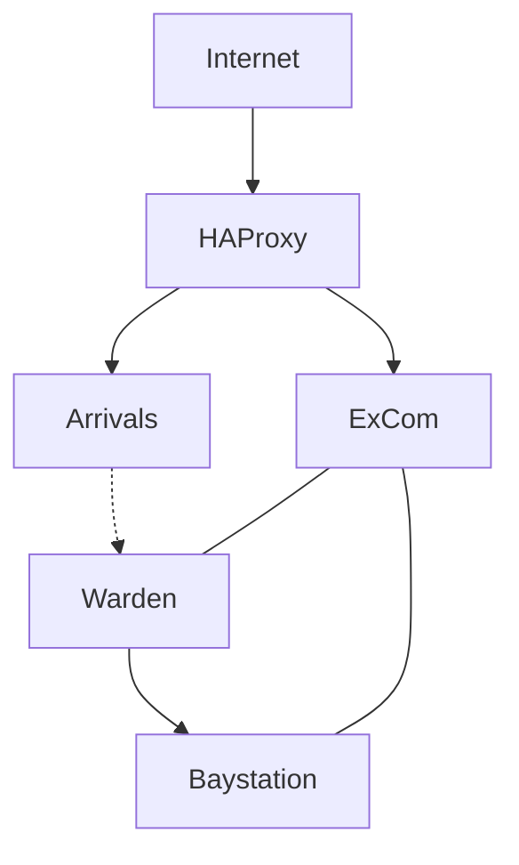

# Baystation

[Website](https://bay.ss13.me) - [Discord](https://bay.ss13.me/discord)

Hi there. Welcome to Baystation. We're a Space Station 13 server and community, and one of the oldest around. You can [check out our archives](https://github.com/orgs/Baystation12/repositories) if you're looking for something old but, otherwise, here's our current active project list.

---

### [Baystation](https://github.com/Baystation12/Baystation12)

[Wiki](https://github.com/baystation12/arrivals/wiki) - [Issues](https://github.com/baystation12/arrivals/issues)

   

The actual space station 13 game server.

---

### [Atlas](https://github.com/Baystation12/Atlas) -- **[View Here](http://atlas.baystation.xyz)**

[Wiki](https://github.com/baystation12/atlas/wiki) - [Issues](https://github.com/baystation12/atlas/issues) - [Projects](https://github.com/baystation12/atlas/projects)

  

A map for baystation's narrative world.

In progress.

---

### [Arrivals](https://github.com/Baystation12/Arrivals)

[Wiki](https://github.com/baystation12/arrivals/wiki) - [Issues](https://github.com/baystation12/arrivals/issues) - [Projects](https://github.com/baystation12/arrivals/projects)

  

A new joinee greeting and IP trust gateway.

In progress.

---

### [Warden](https://github.com/baystation12/warden)

[Wiki](https://github.com/baystation12/warden/wiki) - [Issues](https://github.com/baystation12/warden/issues) - [Projects](https://github.com/baystation12/warden/projects)

  

A packet inspection reverse proxy for the byond protocol.

In progress.

---

### [ExCom](https://github.com/baystation12/excom)

[Wiki](https://github.com/baystation12/excom/wiki) - [Issues](https://github.com/baystation12/excom/issues) - [Projects](https://github.com/baystation12/excom/projects)

  

A discord bot for game server integration, with user and administrative commands.

In progress.

---

Right now we're still in testing and sandboxing and, besides the game server, are probably not running exactly what we publish here. When we're in a stable state we'll recommend a setup like this to people who want a stack of security and user integration, although every part will be optional. We include HAProxy in front of everything for its ability to mitigate some kinds of attack. We also recommend making use of your service provider's firewall or mitigation services where available - a protected server is a playable server.

